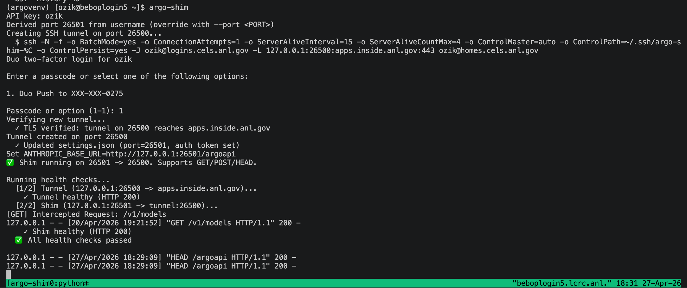
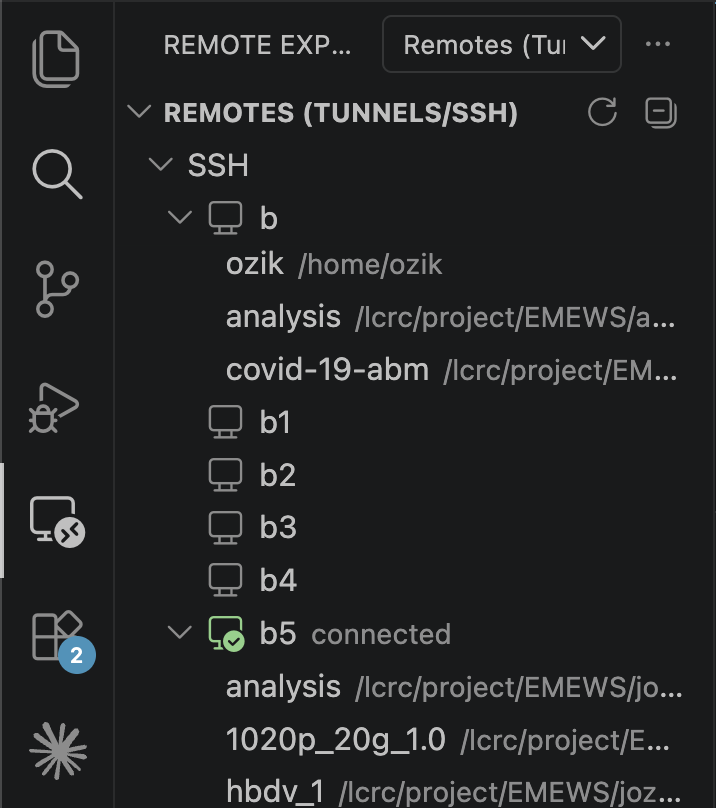
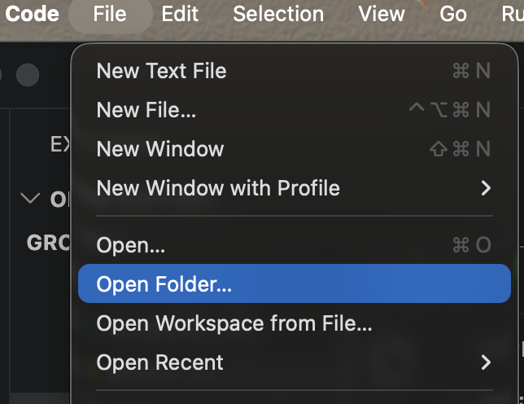
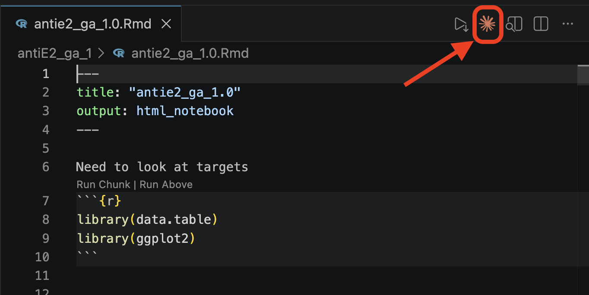

# Running Claude Code on LCRC Bebop via argo-shim

This guide walks through setting up `argo-shim` on LCRC Bebop so you can use Claude Code (CLI and the VS Code plugin) against Argonne GCE resources. Sections 1–6 cover the **login-node** workflow; Section 7 extends it to running Claude Code on a **compute node** through a tunneled `argo-shim`.

## Prerequisites

- A GCE account. See: <https://help.cels.anl.gov/docs/linux/gce-accounts/>
  - You may need to wait a few minutes to make sure your home directory on GCE is setup before continuing
- An SSH key on LCRC for accessing Argonne GCE resources. See: <https://help.cels.anl.gov/docs/linux/ssh/>
  - Test access to GCE from Bebop or your local machine before continuing: `ssh -J <your argonne username>@logins.cels.anl.gov <your argonne username>@homes.cels.anl.gov`
- SSH access to Bebop.

## 1. SSH to Bebop

E.g.,
```bash
ssh bebop.lcrc.anl.gov
```

**Note the specific login node you land on** (e.g., `beboplogin5.lcrc.anl.gov`) — you'll need it later, since `argo-shim` runs on a single login node.

## 2. Create a Python venv with argo-shim

```bash
module load python              # loads python-3.11.9
python -m venv argovenv         # create venv with the loaded python
source argovenv/bin/activate    # activate it
pip install argo-shim           # use `pip install -U argo-shim` to update
```

Each subsequent shell that needs `argo-shim` must re-activate the venv:

```bash
source argovenv/bin/activate
```

## 3. Start argo-shim in a tmux session

A tmux session keeps `argo-shim` running after you disconnect.

```bash
tmux new -s argo-shim                 # new session named "argo-shim"
source argovenv/bin/activate          # make argo-shim visible

# Add your SSH key to the agent before invoking argo-shim
eval "$(ssh-agent -s)"
ssh-add ~/.ssh/id_ed25519             # default name from the CELS docs works

argo-shim                              # start it
```

`argo-shim` will create an SSH tunnel to the CELS hosts and prompt for Duo two-factor authentication. Approve the push, then wait for `✅ All health checks passed`.

> **Note your base port now.** Near the top of the startup output, `argo-shim` prints a line like `Creating SSH tunnel on port <BASE_PORT>...`. `argo-shim` derives this port from your username (it's different for every user). Jot it down — you'll need it later if you run Claude Code on a compute node (Section 7).



Detach from tmux:

```
Ctrl-b d
```


`argo-shim` keeps running on that login node. You can now log off Bebop.

### Reattaching to the tmux session later

When you SSH back to the **same login node** (e.g., `ssh b5` if `argo-shim` is on `beboplogin5`), you can list and reattach to your session:

```bash
tmux ls                # list sessions, e.g. "argo-shim: 1 windows ..."
tmux a -t argo-shim    # reattach by name
```

If you forgot which login node hosts the session, check each `bN` host with `tmux ls` — the session lives on the node where you started it.

### Scrolling the tmux output with the keyboard

To scroll back through the `argo-shim` output (e.g., to inspect earlier requests):

1. Enter copy/scroll mode: `Ctrl-b` then `[`
2. Use the arrow keys, `PageUp` / `PageDown`, etc. to move through the scrollback.
3. Press `q` (or `Enter`) to exit copy mode and return to the shell prompt.

## 4. Configure SSH to target the specific login node

Add entries to your local `~/.ssh/config` so you can reach the exact login node where `argo-shim` is running.

**Generic Bebop entry:**

```sshconfig
Host bebop.lcrc.anl.gov b
    HostName bebop.lcrc.anl.gov
    ProxyJump login-gce
    User <your-username>
    IdentityFile ~/.ssh/<your-lcrc-private-key>
    ForwardX11Trusted yes
    UseKeychain yes
```

**Specific login node entry (e.g., `beboplogin1`):**

```sshconfig
Host b1
    HostName beboplogin1.lcrc.anl.gov
    ProxyJump login-gce
    User <your-username>
    IdentityFile ~/.ssh/<your-lcrc-private-key>
    ForwardX11Trusted yes
    UseKeychain yes
```

Add an analogous entry for whichever login node hosts your `argo-shim` session.

Connect with:

```bash
ssh b1
```

## 5. Install Claude Code on Bebop

On the login node:

```bash
curl -fsSL https://claude.ai/install.sh | bash
```

Try it from a fresh directory:

```bash
mkdir t1
cd t1
claude         # should NOT prompt you to log into Anthropic
```

## 6. Use the VS Code Claude plugin against Bebop

1. In VS Code, open the **Remote Explorer** sidebar and connect to the host where `argo-shim` is running (e.g., `b5` in the example below).

   

2. Find the Claude plugin in the Extensions sidebar — it will prompt you to install it on the remote server (separate from your local Claude plugin).
3. Use **Open Folder** to navigate to your project on Bebop.

   

4. Open any file, then click the orange Claude star icon in the editor toolbar (top-right of the open file) to launch the plugin.

   

## 7. Use Claude Code on a compute node

To run Claude Code on a Bebop **compute node** (e.g., for heavier workloads), chain through the `argo-shim` instance on a login node using its tunnel mode.

### Prerequisite: start a tunneled argo-shim on the login node

In addition to the regular `argo-shim` from Section 3, start a **second** tmux session on the same login node for the tunneled instance. Use the **base port you noted in Section 3, plus 2**, as the `--tunnel-port`:

```bash
tmux new -s argo-shim-tunnel
source argovenv/bin/activate
eval "$(ssh-agent -s)"
ssh-add ~/.ssh/id_ed25519
argo-shim --tunnel --tunnel-port <BASE_PORT+2>
```

Detach with `Ctrl-b d`.

### Get a compute node running argo-shim

Use the submit script in [`agent-bits/`](../agent-bits/) to request a DIS condo compute node, load the environment, and launch `argo-shim` on it pointed back at your login-node tunnel. From any Bebop login node (it does not need to be the one running `argo-shim`), pass the login node that hosts your tunnel as the argument:

```bash
ssh b
/lcrc/project/EMEWS/bebop_setup_kit/agent-bits/submit-argo-shim.sh beboplogin5.lcrc.anl.gov
```

The script submits the batch job, waits for it to start, and prints the compute node it landed on:

```
argo-shim node: dis-00NN
```

**Note that hostname** — you'll need it for the SSH config below (it's also written to `~/argo-shim-node.txt`). The script derives the same ports the login-node tunnel uses, so the two ends connect automatically — there are no port numbers to set by hand on the compute side. Adjust the account/queue/walltime in [`agent-bits/argo-shim.qsub`](../agent-bits/argo-shim.qsub) if your allocation differs.

### Add an SSH config entry for the compute node

On your **local** machine, add an entry that ProxyJumps through Bebop to reach the compute node (replace `dis-00NN` with the hostname the submit script printed):

```sshconfig
Host bcn
    HostName dis-00NN
    ProxyJump b
    User <your-username>
    IdentityFile ~/.ssh/<your-lcrc-private-key>
    ForwardX11Trusted yes
    UseKeychain yes
```

### Connect from VS Code

In VS Code's Remote Explorer, connect to `bcn`. Then follow the same Open Folder + Claude star icon steps from Section 6.
